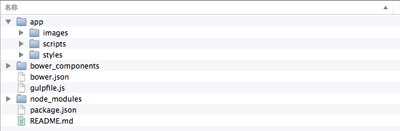
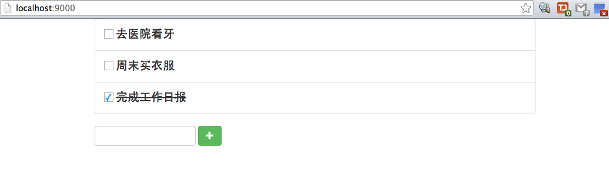
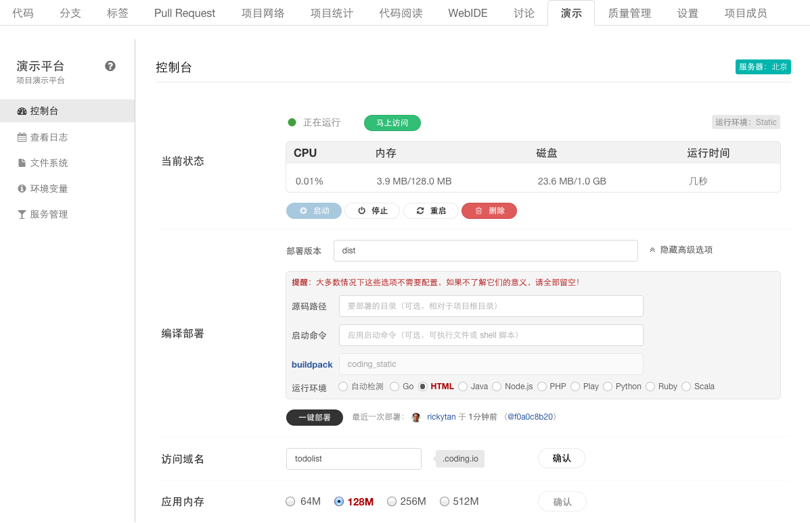

#用 Gulp + Bower + AngularJS 进行 Web 开发并使用 Coding.net 搭建在线演示最佳实践


## 前言
随着 [Coding](http://coding.net) 的迅速发展，它为国内开放者提供了越来越多的便利，其中之一便是免费、一键搭建在线演示站点。它能够自动检测项目所用的语言及运行环境，大多数情况下无需过多配置即可启动演示。本文就如何利用 [Coding](http://coding.net) 提高 Web 开发者效率给出一个最佳实践。

## 项目初始化
本文假设读者已经具备 [Gulp](http://gulpjs.com/) 和 [Bower](http://bower.io/) 的基本知识。

首先，新建一个空目录为作您的工作目录，如：testProject。
<!--more-->

``` bash
mkdir testProject
cd testProject
```

然后初始化 `git`， `bower` 及 `npm`：

``` bash
git init
bower init
npm init
```

新建一个 **app** 目录，您自己的所有源代码和资源文件将放在这里，在 **app** 下面创建 **images**，**scripts**，**styles** 目录分别放置项目所需的图片、脚本和样式文件。

## 安装前端依赖
本文以用 [AngularJS](http://angularjs.org/) 做一个 **ToDo List** 为例，逐步讲述如何用 [Coding](http://coding.net) 搭建演示。

首先安装 **AngularJS**、**Bootstrap**：

```bash
bower install angularjs bootstrap --save
```

## 安装编译依赖
这里的编译是指 **Gulp** 的工作流处理流程。

首先在项目目录下添加如下的 **gulpfile.js** （具体解释请参考官方网站：<http://gulpjs.com/>）：

``` javascript
/*global -$ */
'use strict';
// generated on <%= (new Date).toISOString().split('T')[0] %> using <%= pkg.name %> <%= pkg.version %>
var gulp = require('gulp');
var $ = require('gulp-load-plugins')();
var browserSync = require('browser-sync');
var reload = browserSync.reload;

gulp.task('styles', ['less'], function () {
  return gulp.src('app/styles/main.css')
    .pipe($.postcss([
      require('autoprefixer-core')({browsers: ['last 1 version']})
    ]))
    .pipe(gulp.dest('.tmp/styles'));
});

gulp.task('less', function() {
  return gulp.src('app/styles/*.less')
  .pipe($.less())
  .pipe(gulp.dest('app/styles'))
  .pipe(gulp.dest('dist/styles'));
});

gulp.task('jshint', function () {
  return gulp.src('app/scripts/**/*.js')
    .pipe(reload({stream: true, once: true}))
    .pipe($.jshint())
    .pipe($.jshint.reporter('jshint-stylish'))
    .pipe($.if(!browserSync.active, $.jshint.reporter('fail')));
});

gulp.task('html', ['styles'], function () {
  var assets = $.useref.assets({searchPath: ['.tmp', 'app', '.']});

  return gulp.src(['app/*.html'])
    .pipe(assets)
    .pipe($.if('*.js', $.uglify()))
    .pipe($.if('*.css', $.csso()))
    .pipe(assets.restore())
    .pipe($.useref())
    .pipe($.if('*.html', $.minifyHtml({conditionals: true, loose: false})))
    .pipe(gulp.dest('dist'));
});

gulp.task('images', function () {
  return gulp.src('app/images/**/*')
    .pipe($.cache($.imagemin({
      progressive: true,
      interlaced: true
    })))
    .pipe(gulp.dest('dist/images'));
});

gulp.task('fonts', function () {
  return gulp.src(require('main-bower-files')().concat(['app/fonts/**/*','bower_components/bootstrap/fonts/**/*']))
    .pipe($.filter('**/*.{eot,svg,ttf,woff,woff2,otf}'))
    .pipe($.flatten())
    .pipe(gulp.dest('.tmp/fonts'))
    .pipe(gulp.dest('dist/fonts'));
});

gulp.task('extras', function () {
  return gulp.src([
    'app/*.*',
    '!app/*.html'
  ], {
    dot: true
  }).pipe(gulp.dest('dist'));
});

gulp.task('clean', function () {
	require('del').bind(null, ['.tmp', 'dist/*']);
});

gulp.task('serve', ['styles', 'fonts'], function () {
  browserSync({
    notify: false,
    port: 9000,
    server: {
      baseDir: ['.tmp', 'app'],
      routes: {
        '/bower_components': 'bower_components'
      }
    }
  });

  // watch for changes
  gulp.watch([
    'app/*.html',
    '.tmp/styles/**/*.css',
    'app/scripts/**/*.js',
    'app/images/**/*'
  ]).on('change', reload);

  gulp.watch('app/styles/**/*.less', ['styles', reload]);
  gulp.watch('bower.json', ['wiredep', 'fonts', reload]);
});

// inject bower components
gulp.task('wiredep', function () {
  var wiredep = require('wiredep').stream;

  gulp.src('app/styles/*.scss')
    .pipe(wiredep({
      ignorePath: /^(\.\.\/)+/
    }))
    .pipe(gulp.dest('app/styles'));

  gulp.src('app/*.html')
    .pipe(wiredep({
      exclude: ['bootstrap-sass-official'],
      ignorePath: /^(\.\.\/)*\.\./
    }))
    .pipe(gulp.dest('dist'));
});

gulp.task('build', ['jshint', 'html', 'images', 'fonts', 'extras'], function () {
  return gulp.src('dist/**/*').pipe($.size({title: 'build', gzip: true}));
});

gulp.task('default', ['clean'], function () {
  gulp.start('build');
});
```

然后，使用如下命令安装依赖插件等：

```bash
npm install --save-dev autoprefixer-core browser-sync core-util-is del gulp gulp-bower gulp-cache gulp-csso gulp-filter gulp-flatten gulp-if gulp-imagemin gulp-jshint gulp-less gulp-load-plugins gulp-minify-css gulp-minify-html gulp-postcss gulp-size gulp-uglify gulp-usemin gulp-usemin2 gulp-useref inherits isarray jshint main-bower-files postcss wrapper jshint-stylish
```

以上步骤完成后，您的目录看起来应该是如下的样子：



## 开始编码
所有项目初始工作已经完成，现在可以开始欢快的编码了！

我们首先在 **app** 目录下添加 `index.html` 文件：

```html
<!DOCTYPE html>
<html>
  <head>
    <title>My ToDo List</title>
    <meta charset="utf-8">
    <meta http-equiv="Content-Type" content="text/html; charset=utf-8"/>
    <meta http-equiv="X-UA-Compatible" content="IE=edge,chrome=1" />
    <meta name="viewport" content="width=device-width, initial-scale=1, maximum-scale=1, user-scalable=no">
    <!-- build:css styles/main.css -->
    <link rel="stylesheet" href="/bower_components/bootstrap/dist/css/bootstrap.css" />
    <link rel="stylesheet" href="./styles/main.css" />
    <!-- endbuild -->

    <!-- build:js scripts/app.js -->
    <script type="text/javascript" src="/bower_components/angularjs/angular.js"></script>
    <script type="text/javascript" src="./scripts/app.js"></script>
    <!-- endbuild -->
  </head>
  <body ng-app="App" ng-controller="ListCtrl">
    <div class="container">
      <div class="row">
        <div class="col-md-2"></div>
        <div class="col-md-8">
          <ul class="list-group">
            <li ng-repeat="item in todoItems" class="list-group-item">
              <div class="item">
                <input type="checkbox" ng-model="item.done" />
                <label class="item-content" ng-class="{'item-done': item.done}">{{item.content}}</label>
                <a href ng-click="removeItem(item);" class="item-remove glyphicon glyphicon-remove" aria-hidden="true"></a>
              </div>
            </li>
          </ul>
          <form name="addForm" class="form-inline" ng-submit="addForm.$valid && addItem();" novalidate>
            <input type="text" class="form-control" ng-model="content" required/>
            <button type="submit" class="btn btn-success"><i class='glyphicon glyphicon-plus'></i></button>
          </form>
        </div>
        <div class="col-md-2"></div>
      </div>
    </div>
  </body>
</html>
```

在 **app/styles** 目录下添加 `main.less` 文件：

```less
.item {
    input[type='checkbox'] {
        appearance: none;
        -webkit-appearance: none;
        display: inline-block;
        border: 1px solid #aaa;
        overflow: hidden;
        vertical-align: middle;
        margin-top: -6px;
        width: 16px;
        height: 16px;
        outline: 0;
        &:checked:before {
            content: '✓';
            font-size: 16px;
            text-align: center;
            line-height: 16px;
            color: #00a8e6;
        }
    }
    .item-done {
        text-decoration: line-through;
    }
    .item-content {
        font-size: 20px;
    }
    .item-remove {
        float: right;
        text-decoration: none;
        display: none;
    }
    &:hover {
        .item-remove {
            display: inline;
        }
    }
}
```

在 **app/scripts/** 下添加 `app.js` 文件：

```javascript
(function (angular) {
    angular.module('App', []).controller('ListCtrl', ['$scope', function ($scope) {
            $scope.todoItems = [{
                    content: '去医院看牙',
                    done: false
                }, {
                    content: '周末买衣服',
                    done: false
                }, {
                    content: '完成工作日报',
                    done: true
                }];

            $scope.addItem = function () {
                $scope.todoItems.push({
                    content: $scope.content,
                    done: false
                });
                $scope.content = "";
            };
            $scope.removeItem = function(item) {
                var idx = $scope.todoItems.indexOf(item);
                $scope.todoItems.splice(idx, 1);
            };
        }]);
})(angular);
```

然后，在命令行下运行：

```bash
gulp serve
```

你的浏览器会自动打开预览，同时你所做的修改会实时生效，如下图：



## 编译部署
### 生成上线版
在命令行下执行：

```bash
gulp
```

等待命令完成，项目目录下会新增一个 **dist** 目录，这就是您用来部署上线的所有内容了。打开 `index.html` 可以看到，内容是经过压缩的了。

### 推送到 [Coding](http://coding.net)
在推送 [Coding](http://coding.net) 上部署之前，添加如下 `.gitignore` 文件：

```text
dist/
node_modules/
bower_components/
.tmp/
```

然后使用 `Git` 推送到您在 [Coding](http://coding.net) 上建立的项目。

### 新建 dist 分支
* 首先进入 **dist** 目录

```bash
cd dist
```
* 初始化 `git`

```bash
git init
git remote add origin YOUR_PROJECT_ADDR
git checkout --orphan dist
git add --all
git commit -m 'init dist'
```

* 推送到 dist

```bash
git push origin dist
```

### 部署
打开你在 [Coding](http://coding.net) 上的项目，找到 **演示** 标签，先点击 “自动检测”，通过之后出现如下面板：



点击 “显示高级选项”，勾选 **HTML** 环境，部署版本中填入 **dist**，加上自定义的二级域名，然后**一键部署**，完成！现在你可以通过访问：<http://todolist.coding.io> 查看最终运行效果了。

## 后记
以后开发时，所有代码放在 **app** 目录下，同时运行 `gulp serve` 可以实时预览效果。上线前运行 `gulp` ，生成压缩合并过的资源文件，然后进入 **dist** 目录，运行如下命令将内容推送到 [Coding](http://coding.net)，并再点一次**一键部署**即可！

```bash
git add --all && git commit -m 'update' && git push origin dist
```

`gulp` 工作流包括如下步骤：

1. 去掉 **HTML** 中一切多余的空格、回车、引号等，使页面体积最小；
2. 将多个 **js** 文件合并为一个，并用 [Closure Compiler](https://developers.google.com/closure/compiler/) 压缩；
3. 去除图片中的多余信息，如曝光时间、地理位置等，并使用类似于 [ImageOptim](https://imageoptim.com/) 的算法将图片压缩到最小；
4. 编译 **LESS** 文件为 **CSS**，并将多个 **CSS** 合并、压缩为一个

总之，使线上的版本所用的流量最小化，同时运行速度最快！

本文中的所有源代码均可在：<https://coding.net/u/rickytan/p/GulpCodingBestPractice/git> 上找到，运行如下命令即可看到本文中的效果了：

```bash
git clone https://git.coding.net/rickytan/GulpCodingBestPractice.git
cd GulpCodingBestPractice
npm install
bower install
gulp serve
```

完！

# GulpCodingBestPractice
